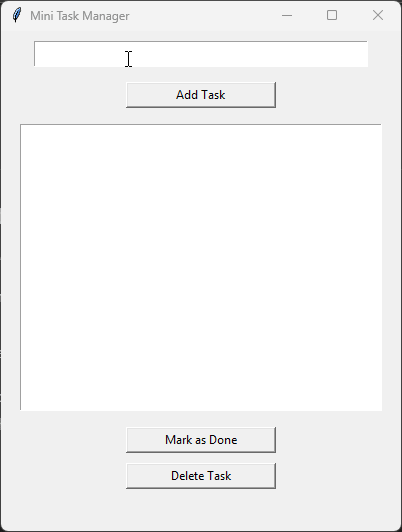

# Mini Task Manager (Python GUI App)

A simple and user-friendly **task management desktop application** built with Python and Tkinter.  
This project demonstrates GUI development, file persistence, and clean code structure.

---

## 🚀 Features

- ➕ Add new tasks
- ✅ Mark tasks as completed
- 🗑️ Delete tasks
- 💾 Automatically saves tasks to file
- 🔄 Loads tasks on startup
- 🖥️ Clean and intuitive GUI

---

## 🎬 Demo

A short demo of the application in action:

---

## 🛠️ Tech Stack

- **Python 3**
- **Tkinter** (GUI Framework)
- **JSON** (Data storage)

---

## 📂 Project Structure

mini-task-manager/
│
├── task_manager.py
├── tasks.json
├── demo/
│ └── demo.gif
└── README.md

---

## ⚙️ Installation & Usage

### Prerequisites
- Python 3.8+

### Run Locally

1. Clone the repository:
    https://github.com/lmakweya9/mini-task-manager.git
2. Navigate to the folder:
    cd mini-task-manager
3. Run the app:
    python task_manager.py

## 📖 How It Works
Tasks are stored as Python dictionaries
Data is saved in a JSON file
The GUI updates automatically when data changes
File persistence allows tasks to remain after closing the app

## ✨ Example
Input: Study Python
Status: Pending

Input: Complete project
Status: Done ✅

## 🔮 Future Improvements
Dark mode
Task categories
Due dates
Search feature
Database integration (SQLite)

## 👨‍💻 Author
Lesego 
Software Developer & Web Developer